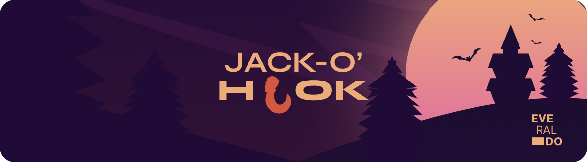

  

# Jack-o'-Hook

 

A spooky collection of react hooks. Compatible with React v18.0.0+.

## 🪝 Hooks

|                     🖱️useMouse                      | 📋useCopyboard                        | 📺useWindowWidth                 | ⚙️ Wip                 |
| :-------------------------------------------------: | ------------------------------------- | -------------------------------- | ---------------------- |
| Tracks mouse cursor in component, and gives coords. | Enables copying text to the clipboard | Returns the user's screen width. | New hooks coming soon. |

## ⚖️ License

Jack-o'-Hook is licensed under the MIT. For more details, see the [LICENSE](./LICENSE) file.
